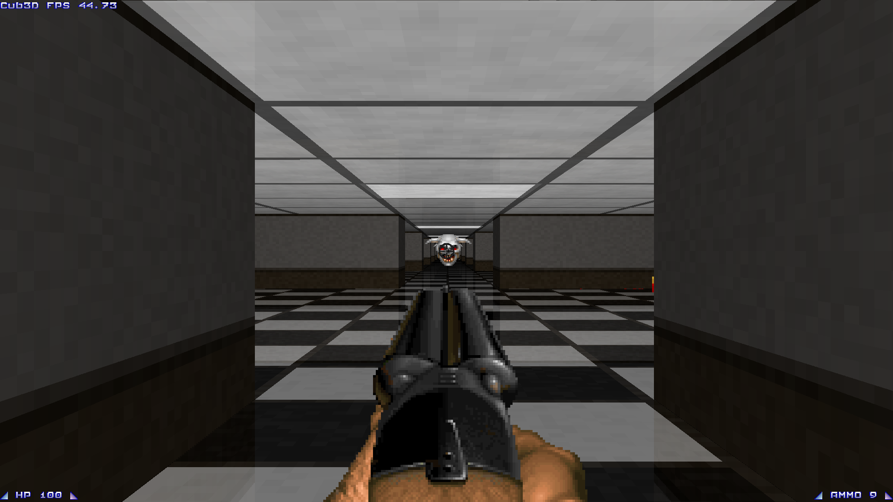

# Description

This project is part of 42's curriculum.

 Screenshot of the game

## Building

Build the basic version using `make`.
To build the fast version, use `make fast`.

## Features
 - Mouse movement
 - Entities (mob, items, particles)
 - Weapons
 - Interactive UI
 - Shading
 - Reflections (floor/ceiling)
 - Multithreading

## Custom Maps

**Materials**
```
MAT CUBE # NO=textures/own/concrete_1.xpm EA=textures/own/concrete_1.xpm SO=textures/own/concrete_1.xpm:fade_color=ff0000 WE=textures/own/concrete_1.xpm
    ^ Material Type                       ^ Texture
MAT FLOOR _ BO=textures/own/tile_checkboard.xpm:reflectivity=155:reflect_color=1f1f1f TO=textures/own/tile.xpm
          ^ Identifier                          ^ Material Properties
```

For walls (*CUBE*), the following material properties are supported:
 * `fade_color` (color) Fading color for dim walls (default: **#000000**).
 * `emission` [0-255] Emission strength of the wall (default: **0**). A fully emmissive wall is not affected by shading.

For surfaces (*FLOOR*), the following material properties are supported:
 * `fade_color` (color) Fading color for far away surfaces (default: **#000000**).
 * `emission` [0-255] Emission strength of the surface (default: **0**). A fully emmissive surface is not affected by distance.
 * `reflectivity` [0-255] Reflectivity of the surface (default: **0**).
 * `reflect_color` (color) Color of the reflected mirror surface (default: **#000000**).

**Properties**

In the map, you can set the following properties:
```
PROP accelerate 15.0 # Player acceleration factor
     ^ Property Name
PROP friction 0.92 # Floor friction factor
              ^ Default Value
PROP frame_time 0.0166666 # Frame duration in ms
PROP player_spawn 0 # Tile type of the player's spawn
```

**Entities**

You can add entities in the world by setting their coordinates in the map file:
```
ENT mob_ghoul (5.5, 5.5) # Spawn a ghoul at (5.5, 5.5)
```

Below is the list of available entities:
 - `item_heal` Heal pack
 - `item_ammo_shotgun` Ammo for the shotgun
 - `item_shotgun` Dropped shotgun
 - `part_shotgun` Shotgun hit particle
 - `item_ammo_chaingun` Ammo for the chaingun
 - `item_chaingun` Dropped chaingun
 - `part_chaingun` Chaingun hit particle
 - `mob_ghoul` Ghoul mob

**Sample custom map**:
```
NO textures/simonkraft/wet_sponge.xpm
SO textures/simonkraft/cyan_concrete.xpm
WE textures/simonkraft/soul_sand.xpm
EA textures/simonkraft/netherrack_02.xpm

F 164,169,20
C 153,204,255

MAT CUBE # NO=textures/own/concrete_1.xpm EA=textures/own/concrete_1.xpm SO=textures/own/concrete_1.xpm WE=textures/own/concrete_1.xpm
MAT FLOOR _ BO=textures/own/tile_checkboard.xpm:reflectivity=155:reflect_color=1f1f1f TO=textures/own/tile.xpm:reflectivity=40
MAT FLOOR ^ BO=textures/own/tile_checkboard.xpm:reflectivity=155 TO=textures/own/tile.xpm:emission=255

PROP player_spawn _

ENT item_chaingun (3.5, 1.5)
ENT item_shotgun (4.5, 1.5)

ENT item_heal (3.5, 3.5)
ENT item_ammo_chaingun (7.5, 3.5)
ENT item_heal (7.5, 7.5)
ENT item_ammo_shotgun (3.5, 7.5)

ENT mob_ghoul (5.5, 11.5)
ENT mob_ghoul (5.5, 17.5)
ENT mob_ghoul (5.5, 23.5)
ENT mob_ghoul (5.5, 29.5)

###########
#____S____#
#_###_###_#
#_#_____#_#
#_#_____#_#
#____^____#
#_#_____#_#
#_#_____#_#
#_###_###_#
#_________#
###########
```

# References

 * Raycasting: [https://lodev.org/cgtutor/raycasting.html](https://lodev.org/cgtutor/raycasting.html)
 * Build engine internals: [https://www.fabiensanglard.net/duke3d/build_engine_internals.php](https://www.fabiensanglard.net/duke3d/build_engine_internals.php)
 * Immediate mode UI:
 [https://en.wikipedia.org/wiki/Immediate_mode_(computer_graphics)](https://en.wikipedia.org/wiki/Immediate_mode_(computer_graphics)),
 [https://github.com/ocornut/imgui](https://github.com/ocornut/imgui)
 * Murmur3: [https://en.wikipedia.org/wiki/MurmurHash](https://en.wikipedia.org/wiki/MurmurHash#Algorithm)
 * Red-Black tree:
 [http://www.sgi.com/tech/stl/stl_tree.h](https://web.archive.org/web/20151027100052/http://www.sgi.com/tech/stl/stl_tree.h),
 [https://github.com/xieqing/red-black-tree](https://github.com/xieqing/red-black-tree)
